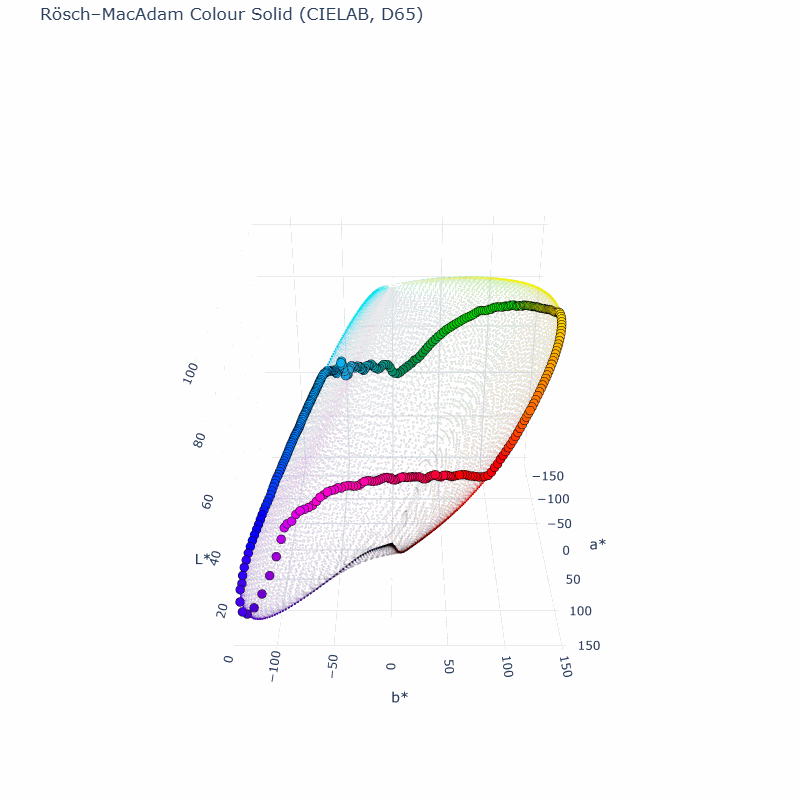
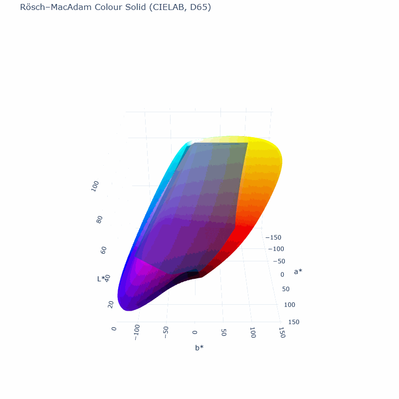

# Project Title

Surface of colour solid is shown representing optimal colours. These are the colours an average human eye can perceive perceptually equally spaced.
It is used as reference to quantify the performance of a pigment. Two ratios are taken for a given hue: chroma effciency and lightness efficiency,
each as ratio of the from the spectrum calculated chroma and lightness divided by their at the same hue corresponding maximal values.

<p align="center">
  
  
  <p align="center">
  
---

## Features
- **Feature 1**: Computes and plots colour solid in CIELAB coordinate system.
- **Feature 2**: Shows rgb ebu colorspace within.
- **Feature 3**: Use from Spectrum_ColorProps import compute_color_properties to compute chroma and lightness performance of a spectrum respectively to its hue.

---

## Installation

## How to run
```bash
python main.py
